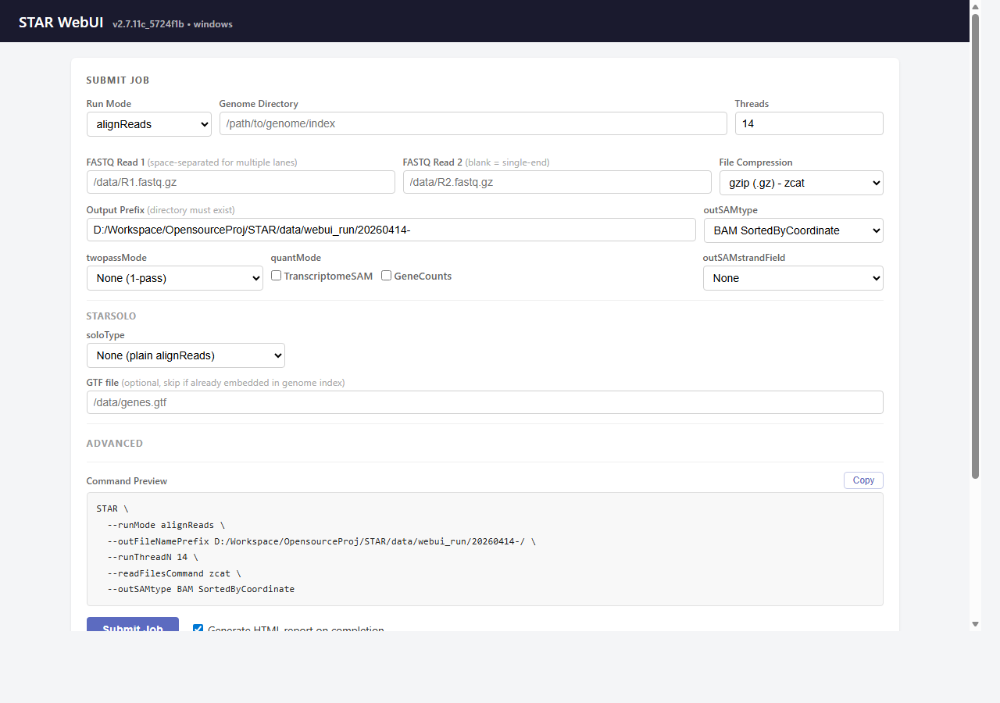
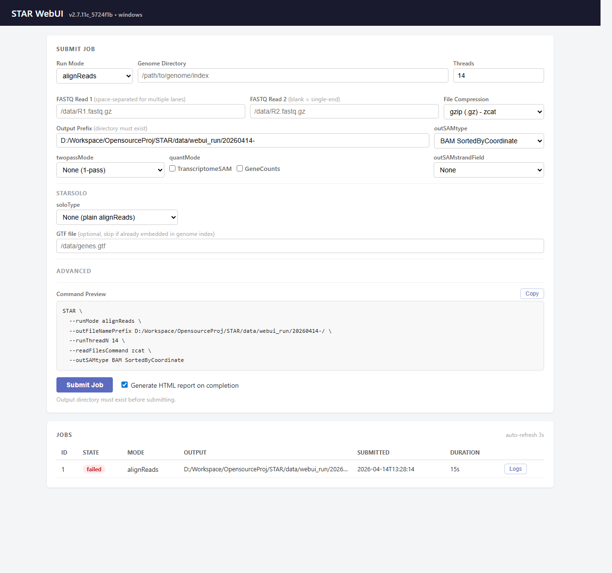

# Local Web UI

Start STAR-Cross with an output prefix:

```sh
STAR --runMode webui --webuiPort 8080 --outFileNamePrefix results/
```

On Windows, use `STAR.exe`. Open `http://127.0.0.1:8080` in a browser.
Submitted paths refer to files on the machine running STAR-Cross, not to files
on a remote browser's computer.

## Submit a job

Select `alignReads`, `genomeGenerate` or `soloCellFiltering`, supply the input
and output paths, and check the generated command before submitting.
STARsolo presets provide starting barcode/UMI settings; verify that the preset
matches the library chemistry and read layout.



The job table shows queue state, timestamps and output locations. Completed
jobs expose logs and available reports/artifacts. A completed process still
needs output inspection and any validation required by your analysis.



## Server options

| Option | Default | Meaning |
| --- | --- | --- |
| `--webuiPort` | `8080` | Listening port |
| `--webuiHost` | `127.0.0.1` | Bind address |
| `--outFileNamePrefix` | Supply explicitly | Initial output prefix in the form |

Keep the default loopback address for local use. Changing the bind address is
not an authentication or secure-public-hosting configuration; do not expose the
server to untrusted networks without separate access controls.
